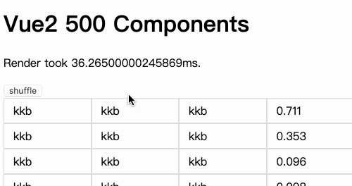

# vue3-vs-vue2
Vue3和Vue2细致比较

@todo  mvc样式   


## 环境

三种体验vue3的方式

1. vue-cli
   * Vue create vue3-demo-cli
   * Vue add vue-next
   * 代码文件 vue3-demo-cli
2. webpack
   1. 代码文件 vue-demo-webpack
   2. [代码仓库](https://github.com/vuejs/vue-next-webpack-preview)
3. 新工具vite
   1. create-vite-app 
   2. 代码文件 vue3-demo-vite


## Reactivity  & Fragment

 Winter奇思妙想   [代码](reactivity)

```
├── Fragment.vue
├── HTTPRequest.js    数据源响应式
├── HTTPRequest.vue 
├── List.vue
├── LocalStorage.js   利用响应式，无缝切换localstorage
├── LocalStorage.vue
├── Three.vue
├── ThreeRender.js
├── TimeLine.js
├── Timer.js          
├── assets
│   └── logo.png
├── main.js
└── vanilla-main.js   原生js双向绑定
```


## SSR

测试vue2和vue3再ssr的环境的表现,使用wrk压测，测试组件 静态动态三比一

```javascript
{
    template: `<div>
    <div v-for="n in 1000">
    <ul >
      <li>kkb</li>
      <li>kkb</li>
      <li>kkb</li>
      <li>kkb</li>
      <li>kkb</li>
      <li>kkb</li>
      <li v-for="todo in todos" >{{n}}--{{todo}}</li>
    </ul>
    </div>
    </div>`,
    data(){
      return {
        todos:['吃饭','睡觉']
      }
    }
  }

```
再vue-comp里执行npm link 然后ssr2和ssr3里npm install共享 

```bash
// vue2 12个进程，300个并发，压19秒
➜  ~ wrk -t12 -c400 -d10s http://localhost:9092/
Running 10s test @ http://localhost:9092/
  12 threads and 400 connections
^[[A  Thread Stats   Avg      Stdev     Max   +/- Stdev
    Latency     1.48s   442.21ms   1.80s    89.88%
    Req/Sec    24.62     20.56    88.00     59.73%
  1319 requests in 10.10s, 173.65MB read
  Socket errors: connect 157, read 183, write 0, timeout 74
Requests/sec:    130.58
Transfer/sec:     17.19MB
```
```bash
// vue3 12个进程，300个并发，压19秒
➜  ~ wrk -t12 -c400 -d10s http://localhost:9093/
Running 10s test @ http://localhost:9093/
  12 threads and 400 connections
  Thread Stats   Avg      Stdev     Max   +/- Stdev
    Latency   770.76ms  165.36ms   1.89s    89.11%
    Req/Sec    63.99     56.81   252.00     74.34%
  2912 requests in 10.10s, 411.12MB read
  Socket errors: connect 157, read 31, write 0, timeout 0
Requests/sec:    288.21
Transfer/sec:     40.69MB
```
QPS大概是有2.2倍的提升 真赞


## update 对比

```bash
vue2-demo
vue3-demo-cli
```
[测试组件代码 ](vue-demo/src/App.vue)      500个组件，静态动态三比一

Vue2 render和update   大概50%  稍微有点波动




## composition vs option 

[官网的对比代码](com)

todo mvc 对比  

@todo 需要加点样式 

@todo 把storage和http的响应式，放在todomvc里


## 自定义renderer

[canvas和three.js](custom-renderer)

[pixi renderer打飞机demo](vue3-runtime-canvas)

```javascript
import { createApp } from './three-renderer';
import App from "./App.vue";

// canvas
// import { createApp } from './renderer';
// import App from "./App1.vue";
createApp(App).mount("#app")
```


